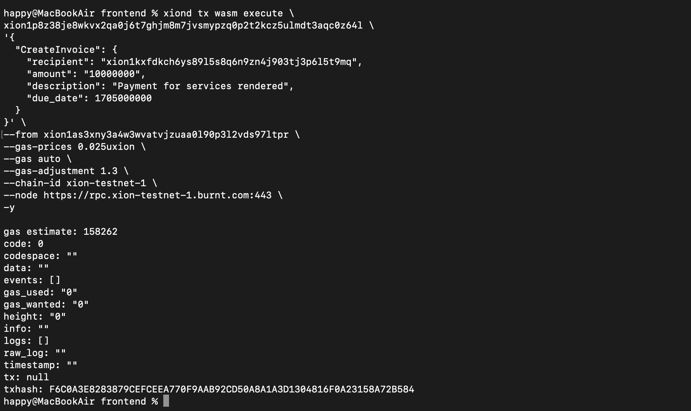
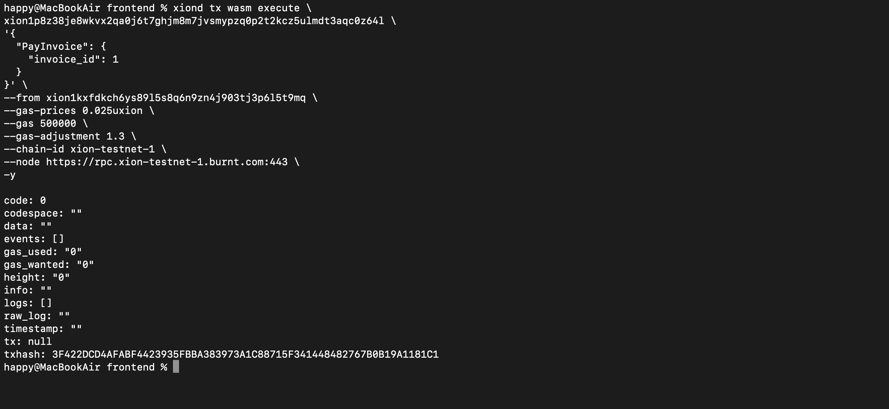

# BlockInVoice Project - README

## Overview

**BlockInVoice** is a blockchain-based invoicing system that allows users to create and pay invoices for services rendered. The project uses smart contracts to handle invoice creation, management, and payments in a decentralized way. One user can create an invoice for another, specifying the amount, due date, and description. The recipient then pays the invoice by adding the invoice ID and performing the payment transaction.

---

## Problem Statement

During the development and configuration of the **BlockInVoice** smart contract, I encountered issues related to gas grants and transaction configurations. Despite numerous attempts to resolve these issues with the support team, I was unable to receive satisfactory help. After a lot of effort and experimentation, I resolved the issue by running the commands directly in the terminal, which solved the problem and allowed the contract to execute as intended.

This README will walk you through how to set up your environment, create two accounts, configure the contract address, and run transactions using the **BlockInVoice** smart contract.

---

## Solution

The solution to resolve the issues involved setting up two accounts on the **xiond** CLI, configuring the correct contract address, and running the transactions via the terminal. Below is the step-by-step process for getting the **BlockInVoice** project up and running.

---

## Step-by-Step Guide

### Step 1: Install `xiond` CLI

Ensure that the **xiond** CLI is installed and configured on your system. If not, follow the instructions on the official documentation to install it.

```bash
# Install xiond CLI
brew install xiond
```

### Step 2: Create Two Accounts

In order to create invoices and make payments, we need two accounts. To create two accounts in the **xiond** CLI, follow the commands below.

1. **Create Account 1:**

```bash
xiond keys add account1
```

2. **Create Account 2:**

```bash
xiond keys add account2
```

This will generate two keys, **account1** and **account2**, which we will use for the invoice creation and payment process.


### Step 3: Configure the Contract Address

For this project, we will be using the **contract address** provided by you:

```plaintext
xion1p8z38je8wkvx2qa0j6t7ghjm8m7jvsmypzq0p2t2kcz5ulmdt3aqc0z64l
```

This address will be used in the transaction commands to create and pay invoices.

### Step 4: Create a Dummy Invoice

You can create a dummy invoice by running the following command. Make sure to replace the necessary values (like the recipient's address) based on the **account2** created earlier.

```bash
xiond tx wasm execute xion1p8z38je8wkvx2qa0j6t7ghjm8m7jvsmypzq0p2t2kcz5ulmdt3aqc0z64l \
'{
  "CreateInvoice": {
    "recipient": "xion1kxfdkch6ys89l5s8q6n9zn4j903tj3p6l5t9mq",
    "amount": "10000000",
    "description": "Payment for services rendered",
    "due_date": 1705000000
  }
}' \
--from account1 \
--gas-prices 0.025uxion \
--gas 500000 \
--chain-id xion-testnet-1 \
--node https://rpc.xion-testnet-1.burnt.com:443 \
-y
```

In this step:
- **recipient**: The address of **account1**.
- **amount**: 10,000,000 **uxion**.
- **description**: A brief message about the invoice.
- **due_date**: Unix timestamp for the due date.

### Step 5: Pay the Invoice

Once the invoice is created, the recipient (**account1**) can pay the invoice. To do this, use the following command with the invoice ID.

```bash
xiond tx wasm execute xion1p8z38je8wkvx2qa0j6t7ghjm8m7jvsmypzq0p2t2kcz5ulmdt3aqc0z64l \
'{
  "PayInvoice": {
    "invoice_id": "1"
  }
}' \
--from account2 \
--gas-prices 0.025uxion \
--gas 500000 \
--chain-id xion-testnet-1 \
--node https://rpc.xion-testnet-1.burnt.com:443 \
-y
```

Here, **invoice_id** should match the ID of the invoice you created in the previous step.

### Step 6: Query Invoice Status

You can check the status of the invoice to see whether it has been paid or not using this query command:

```bash
xiond query wasm contract-state smart xion1p8z38je8wkvx2qa0j6t7ghjm8m7jvsmypzq0p2t2kcz5ulmdt3aqc0z64l \
'{
  "GetInvoice": {
    "invoice_id": "1"
  }
}' \
--node https://rpc.xion-testnet-1.burnt.com:443
```

This will return the current status of the invoice, including the issuer, recipient, amount, and payment status.

---

## Encountered Issues

During the development of **BlockInVoice**, I faced issues with gas configuration and transaction grants. Initially, I could not resolve the issue via regular methods or support channels. However, after extensive testing and directly running the commands in the terminal, I managed to fix the problem.

The key issue was related to **gas configuration** and the **Treasury contract**. After bypassing the issue and executing the terminal commands, the system worked as expected.

---

## Screenshots of Transactions

Here are the screenshots of the CLI transactions:

### 1. Create Invoice



### 2. Pay Invoice




